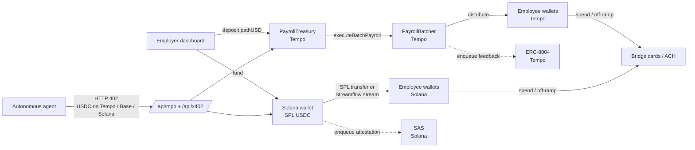
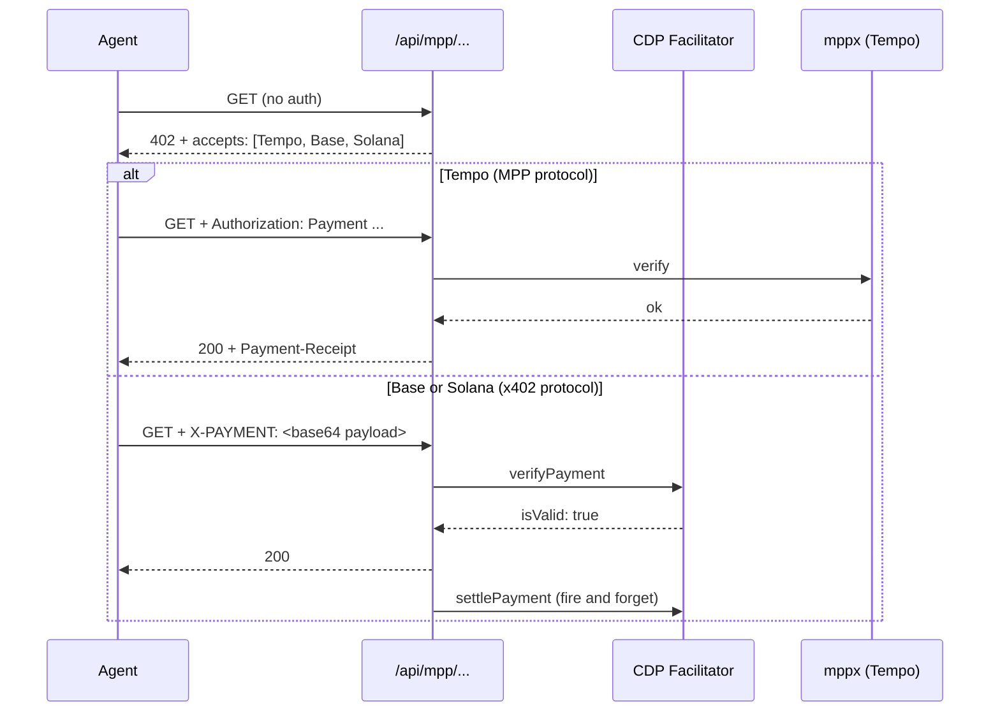

Remlo is a two chain protocol with three primitives. Tempo handles fast batched payroll and ERC-8004 reputation. Solana handles three party escrow and Solana Attestation Service (SAS) credentials. Agents pay our APIs in USDC on Tempo, Base, or Solana. Bridge handles fiat on-ramp and off-ramp where employees want it.

## Settlement layers

## How payroll settles

**Tempo.** The employer deposits pathUSD (USDC.e) into the `PayrollTreasury` contract via the dashboard's on-chain deposit widget. The widget signs a `transferWithAuthorization` plus a `deposit` call from the employer's Privy embedded wallet, with the deposit memo's first 8 bytes matching `bytes8(keccak256(employerAdminWallet))` so off-chain accounting can't be spoofed (audit fix M-1). Funds sit in the Treasury under per employer accounting. When payroll runs, `PayrollBatcher.executeBatchPayroll` pulls the exact total, distributes to each recipient, and attaches a 32-byte ISO 20022 memo per item. Settlement lands in the same block.

**Solana.** Payroll is either a one shot SPL USDC transfer or a Streamflow stream. The Privy Solana server wallet is policy gated to the SystemProgram, Token Program, Token-2022 Program, and Streamflow Program. No raw key signs Solana transactions. Each settled payment enqueues a SAS `payment-completed` attestation that the reputation cron drains and writes on-chain.

## How escrow settles

Three parties: requester, worker, validator.

1. Requester locks USDC in an escrow PDA via the `remlo_escrow` Anchor program. Rubric and worker wallet are recorded on-chain.
2. Worker submits a deliverable URI off-chain (HTTP). Remlo computes SHA-256 of the fetched content and records the hash on-chain, then invokes the validator.
3. Validator runs against the rubric and produces a verdict (`approved` | `rejected`). The validator's signature lands on-chain via `post_verdict`. Default validator is Claude; multi validator councils with `simple_majority` / `unanimous` / `weighted` rules are supported.
4. Once `post_verdict` is recorded, anyone can crank `settle` (approved → release to worker) or `refund` (rejected → return to requester). Both are permissionless.

The Remlo Privy Solana wallet's policy whitelist allows only `post_verdict`. Even with a fully compromised server, funds in escrow PDAs remain claimable by the correct counterparty because the program rejects any settle that doesn't match the recorded verdict and PDA derivation.

## How reputation writes happen

Settled work enqueues a row in the `reputation_writes` queue. A Vercel cron (`/api/cron/process-reputation-writes`) drains the queue every 10 minutes:

- **Solana writes** go to one of four SAS schemas (`payment-completed`, `escrow-settled`, `escrow-refunded`, `employer-verified`) under our credential authority `BxoTaz3cb…`. Signed by the Privy Solana server wallet.
- **Tempo writes** call `ReputationRegistry.giveFeedback` with `int128` value on a -100..100 scale, structured tags (`escrow`, `settled` / `rejected`, etc.), and a deterministic feedback hash so consumers can verify the off-chain reasoning.

The escrow flow reads SAS attestation counts before posting a new escrow and tiers worker wallets accordingly. Trusted workers (20+ prior attestations) get shorter expiry floors; new workers get the full configured period.

## How agents pay

Most paid endpoints accept three rails in one 402 response. The challenge surfaces all options at once and the agent's HTTP client (AgentCash, raw `@x402/core`, custom code) picks the rail it has balance on.

Server inspects which header the agent supplied:

- `Authorization: Payment ...` routes to mppx Tempo verification (Tempo's embedded facilitator). Legacy `Authorization: mpp ...` is accepted for older wrappers.
- `X-PAYMENT` routes to `@x402/core` with both Exact EVM (Base) and Exact SVM (Solana) schemes registered against the CDP facilitator.

State mutating endpoints that touch Tempo treasury balances (payroll execute, fiat off-ramp) intentionally stay Tempo only. Charging in another currency for a Tempo state mutation creates a settlement asymmetry that doesn't roll back cleanly if the on-chain action reverts.

## Trust boundaries

- **Funds.** Employer treasuries on Tempo, employee wallets on Solana, and escrow PDAs are never accessible via any off-chain Remlo key. The protocol is the trust boundary.
- **Privy server wallets.** Policy gated to whitelisted programs, instructions, and chains. A drift in policy attachment is detected at signing time (`assertPrivyPolicyAttached`), and the signer fails closed if the policy was removed.
- **Webhook surfaces.** Bridge webhooks use RSA signature verification per their published spec. Tempo webhooks use HMAC. Resend webhooks use Svix. All three reject missing or stale signatures with 401.
- **Auth.** Privy ES256 JWTs verified via Web Crypto on edge and Node. No symmetric secret in the auth path.
