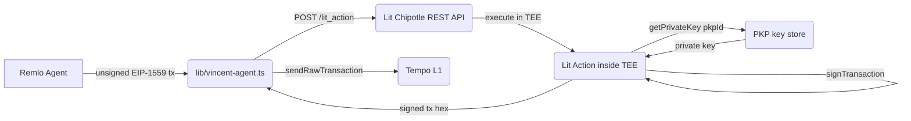

Remlo's autonomous payroll agent signs Tempo L1 transactions using [Lit Protocol Chipotle](https://developer.litprotocol.com) — a distributed Trusted Execution Environment network. The agent wallet is a PKP (Programmable Key Pair) whose private key is generated and held inside Lit's TEE network. It never exists in one place, and no single node can sign independently.

The integration uses the Chipotle REST API directly. No SDK node client is required.

## Why Remlo Uses Lit

Payroll is the highest-stakes transaction an employer can authorize. Remlo uses Lit Protocol for three reasons that are specific to the payroll context and cannot be replicated with a hot wallet or a traditional HSM:

**1. Employer-delegated, non-custodial agent authorization**

Remlo operates as an autonomous payroll agent on behalf of employers. The employer should not need to hand Remlo their private key to run payroll. With Lit, the employer's PKP wallet signs transactions — Remlo holds a delegatee key that can trigger signing but has no ability to extract the private key or sign anything outside the authorized policy. The employer retains cryptographic ownership of the signing identity at all times.

**2. Programmable spend policies enforced in the TEE**

The Contract Whitelist Policy restricts the PKP to only sign transactions targeting `PayrollBatcher` and `YieldRouter` on Tempo L1. No other contract can be called by the agent — not because Remlo's server enforces it, but because the Lit Action code running inside the TEE enforces it before signing. This turns compliance guardrails from an application-layer promise into a cryptographic guarantee.

**3. Verifiable on-chain audit trail without a centralized key custodian**

Every payroll disbursement signed by the PKP wallet produces a Tempo L1 transaction with a `from` address that is cryptographically linked to a Lit-managed key. An auditor can verify, without trusting Remlo's servers, that the signing key was controlled by the Lit TEE network — not by a hot wallet sitting on Remlo's infrastructure. For ISO 20022-compliant payroll, this separation between authorization (employer PKP) and execution (Remlo agent) is the moat.

## Signing Architecture



The PKP private key never leaves the TEE. The Lit Action code runs in a Verified TEE, retrieves the key, signs the transaction, and returns only the signed output.

## How It Works

**PKP Wallets** are non-custodial wallets created via the Lit Chipotle API. The private key is generated inside TEEs and sharded across the Lit node network. No single party holds the complete key.

**Lit Actions** are immutable JavaScript programs stored on IPFS. When executed, they run inside the TEE alongside the PKP key material. The action can sign transactions, encrypt data, and make HTTP requests — all verifiably within the enclave.

**Groups** control which Lit Actions can execute and which PKPs they can access. The Remlo signing action is pre-authorized in a group that includes the Remlo PKP wallet.

## Environment Variables

| Variable | Description |
|---|---|
| `LIT_API_KEY` | Admin API key. Manages groups, PKPs, and action authorization. Server-only, never expose to client. |
| `LIT_USAGE_KEY` | Execute-scoped key. Used by `signWithVincent()` at runtime. Server-only. |
| `VINCENT_PKP_ETH_ADDRESS` | The PKP wallet address on Tempo L1. This is where agent funds live. |

## Signing Flow

`lib/vincent-agent.ts` exports `signWithVincent(unsignedTx)`:

```typescript
import { signWithVincent, type UnsignedTempoTx } from '@/lib/vincent-agent'

const unsignedTx: UnsignedTempoTx = {
  to: '0x90657d3F18abaB8B1b105779601644dF7ce4ee65', // PayrollBatcher
  value: 0n,
  data: encodedCalldata,
  chainId: 4217,
  nonce: await publicClient.getTransactionCount({ address: pkpAddress }),
  gasLimit: await publicClient.estimateGas({ ... }),
  maxFeePerGas: gasPrice,
  maxPriorityFeePerGas: tip,
}

const signedTx = await signWithVincent(unsignedTx)
await publicClient.sendRawTransaction({ serializedTransaction: signedTx })
```

The function serializes the transaction using ethers v5, POSTs to `POST /lit_action` with the signing Lit Action code and the PKP address, and returns the signed transaction hex.

The Lit Action itself is a stable constant — its IPFS CID is `QmSAfc7Hh6MPhe3T3fTBVEvryYR6ChaeHf2icins23aET7`. Any change to the action code produces a new CID that must be re-authorized before it can execute.

## Setup

Run the registration script once to provision a Lit account, PKP wallet, signing group, usage key, and pre-authorize the signing action:

```bash
npx ts-node scripts/setup-vincent.ts
```

For an existing account:
```bash
LIT_API_KEY=<your-admin-key> npx ts-node scripts/setup-vincent.ts
```

The script prints the three env vars to add to `.env.local`. For production, prefix with `LIT_API_URL=https://api.litprotocol.com/core/v1`.

## Lit Chipotle REST API

The Chipotle API is available at `https://api.dev.litprotocol.com/core/v1` (dev) and `https://api.litprotocol.com/core/v1` (production). Key endpoints:

| Endpoint | Description |
|---|---|
| `POST /new_account` | Create a Lit account — returns admin API key and account wallet |
| `GET /create_wallet` | Mint a new PKP wallet |
| `POST /add_group` | Create an action group |
| `POST /add_action_to_group` | Authorize a Lit Action IPFS CID to execute in a group |
| `POST /add_usage_api_key` | Create a scoped key with specific permissions |
| `POST /lit_action` | Execute a Lit Action in a TEE |

Full API reference: [api.dev.litprotocol.com/swagger-ui/](https://api.dev.litprotocol.com/swagger-ui/)

## PKP Wallet

The Remlo agent PKP wallet on the dev network is `0x3324a8B644a78ed5c9EEBbD0e661b67FE417342F`. Fund this address on Tempo L1 (chainId `4217`) with pathUSD for payroll operations. The PKP pays its own gas.

## Contract Whitelist

For production, restrict the PKP to only sign transactions targeting approved Remlo contracts by adding policy enforcement to the Lit Action:

```javascript
const ALLOWED_CONTRACTS = [
  '0x90657d3f18abab8b1b105779601644df7ce4ee65', // PayrollBatcher
  '0x78b0548c7bb5b51135bbc87382f131d85abf1061', // YieldRouter
]

async function main({ pkpId, unsignedTxHex }) {
  const tx = ethers.utils.parseTransaction(unsignedTxHex)
  if (!ALLOWED_CONTRACTS.includes(tx.to?.toLowerCase())) {
    throw new Error(`Contract ${tx.to} not in whitelist`)
  }
  const wallet = new ethers.Wallet(await Lit.Actions.getPrivateKey({ pkpId }))
  const signedTx = await wallet.signTransaction(tx)
  return { signedTransaction: signedTx }
}
```

Changing the action code produces a new IPFS CID — run `setup-vincent.ts` to authorize it before deploying.
