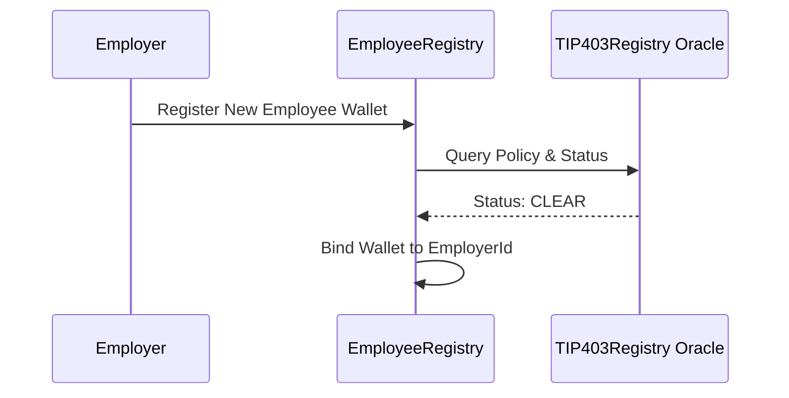

The `EmployeeRegistry` contract links real-world corporate entities to on-chain Tempo wallets, serving as the foundational directory required to issue payments while enforcing continuous compliance.

## The Registration Process

When an employer adds a new employee to their team through the dashboard, their individual wallet address must first be registered on-chain via the `EmployeeRegistry`.

During registration, the contract automatically invokes the embedded `TIP403Registry` precompile (`0x403c...00`) to confirm the wallet is not blacklisted, sanctioned, or operating under explicit restricted flags by the governing oracle. 

If the compliance check passes, the contract links the wallet to the specific `employerId`. If the oracle returns a failure state due to AML or sanctions flags, the registration is hard-reverted and the employee cannot be formally added to the payroll roster.

## Underlying Data Mapping

Because Remlo operates on a fundamentally transparent ledger, the registry relies on cryptographic hashes to secure PII. The registry stores:
- `wallet`: The Tempo-compatible receiving address that is verified.
- `employerId`: The entity authorizing and funding the payroll batches.
- `employeeIdHash`: An encrypted hash mapping directly back to the employee's Personally Identifiable Information in the secure off-chain Supabase database.
- `active`: A boolean toggling whether the employee is eligible and active for the upcoming batch run.

By segregating compliance state and public wallet connections from sensitive PII, Remlo maintains bank-grade security without compromising its on-chain operational efficiency.
