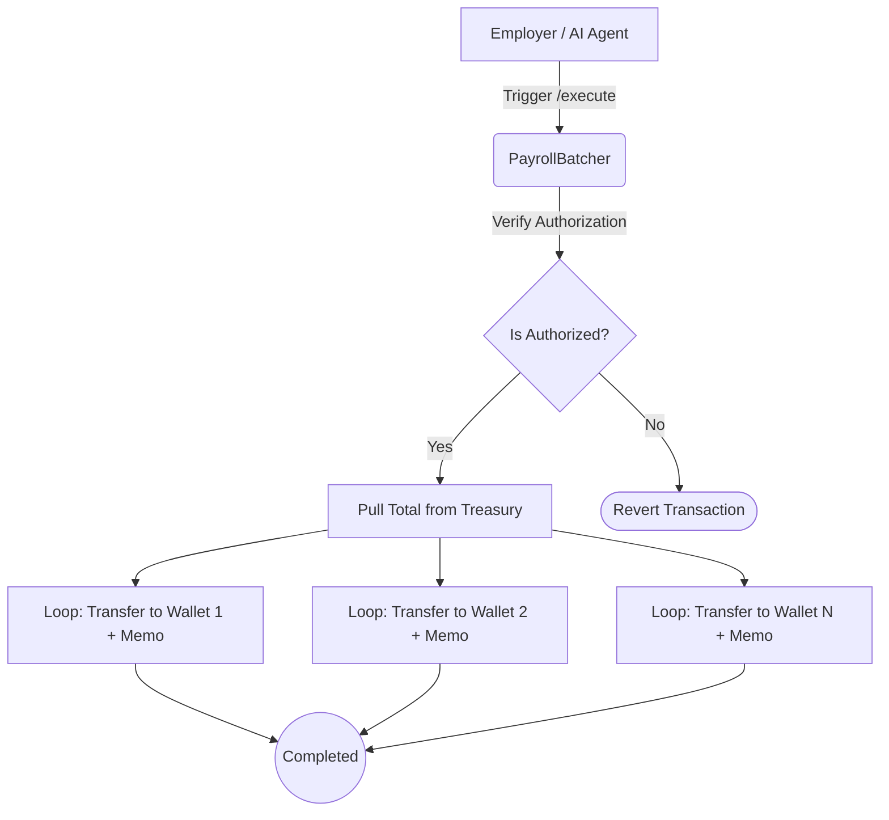

The `PayrollBatcher` handles the transactional heavy lifting when an employer processes a periodic payroll cycle for their entire team. 

Relying on individual wallet-to-wallet transactions for a large workforce is computationally expensive, prone to nonce-collisions, and consumes excessive time. The batcher circumvents this by coordinating the bulk distribution of all salaries into a single atomic on-chain operation.

## Execution Flow and Parameters

When triggered (either manually via the dashboard or programmatically by an AI agent through AgentCash), the batcher's primary execution function `executeBatchPayroll` receives three critical arrays arrays matching the workforce index:

1. `recipients`: An array containing every receiving employee's on-chain wallet address.
2. `amounts`: The exact stablecoin amount each employee is owed for the given cycle.
3. `memos`: A matching array of 32-byte TIP-20 encoded memos ensuring strict accounting compliance for the transfer.

The contract loops through the `recipients` arrays to issue stablecoin transfers. By executing on the Tempo L1 utilizing its high-throughput engine, the gas overhead for this massively parallel operation is fractions of a cent, and execution finality is virtually instantaneous.

### Agent Authorization Boundaries

Because the batcher directly interfaces with the `PayrollTreasury` to disburse capital, the `executeBatchPayroll` method is locked behind strict access controls. 

If an AI agent calls the executor autonomously via the MPP endpoint (`/api/mpp/payroll/execute`), the smart contract verifies the session's validity, the agent's pre-approved spending keys, and the `lockedBalance` state inside the treasury before the batcher is allowed to move a single cent.
