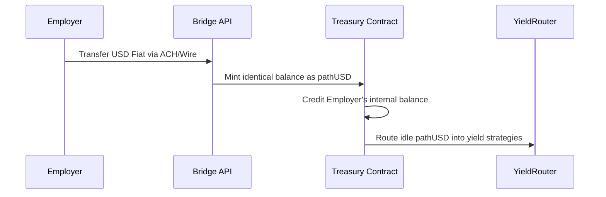

The `PayrollTreasury` contract is the foundational component of Remlo's execution layer on the Tempo network. It acts as a secure, decentralized holding layer where employers deposit and manage their capital prior to executing a payroll cycle.

By moving treasury management entirely on-chain, employers gain complete transparency over their funds, while unlocking the ability to programmatically route idle capital into DeFi yield strategies before payday.

## How the Treasury Operates

The `PayrollTreasury` manages several disparate states for every registered employer simultaneously, ensuring that general payroll capital is effectively separated from operational gas budgets.

1. **Deposits and Minting**: Employers fund their treasury using fiat via the Bridge API integration. When funds clear, Bridge mints the equivalent amount in stablecoins (e.g., pathUSD) directly into the treasury on behalf of the employer's unique identifier.
2. **Gas Funding**: The treasury securely separates the main payroll balance from a dedicated gas budget. This architectural design ensures that autonomous payroll runs or low-level streaming claims never fail midway due to an empty gas tank.
3. **Yield Integration**: Capital sitting idle for days before a payday is inefficient. The treasury natively integrates with the `YieldRouter` to automatically deploy unutilized stablecoins into risk-averse DeFi yield protocols, effectively establishing an automated treasury management system.
4. **Disbursement**: When the `PayrollBatcher` executes a run, it explicitly verifies the treasury's `availableBalance`. If sufficient, the batcher seamlessly draws the exact payroll total and automatically handles the distribution.

### Contract State Mapping

Under the hood, the `PayrollTreasury` maps the `msg.sender` derived Employer ID to a distinct `EmployerAccount` struct. This mapping guarantees that an employer's funds can never be co-mingled or improperly accessed by another entity.

The struct tracks:
- `balance`: The total available stablecoins ready to distribute as payroll.
- `gasBudget`: Pre-funded tokens reserved solely to pay for transactional overhead.
- `lockedBalance`: Funds dedicated to in-flight runs that cannot be withdrawn or routed.
- `policyId`: The explicit TIP-403 compliance policy bound to this employer.
