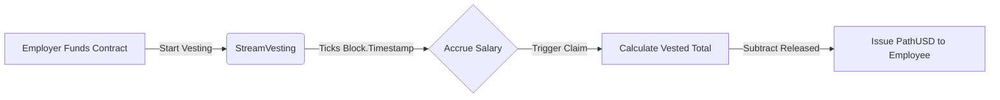

Standard payroll usually operates in discrete, bi-weekly or monthly batches. Remlo introduces `StreamVesting` to allow employers to pay their teams continually—by the second—replacing stagnant ledgers with fluid capital routing.

## Implementing Salary Streaming

When an employee is configured for a streaming payroll structure, the employer defines a total amount, a specific stream start time, and an end time reflecting the pay cycle bounds.

The `StreamVesting` contract mathematically calculates the employee's vested available balance completely on-chain in real-time. Because of the immutable nature of block timestamps on the Tempo network, the exact accrued float is always mathematically guaranteed without requiring secondary execution layers or off-chain workers.

### Claiming Accruals

Under a traditional model, an employee must wait weeks to see their paycheck deposit. With Stream Vesting, the employee or their automated agent can invoke `claimAccrued` via the `POST /api/mpp/employee/advance` endpoint at any point.

The contract logic runs as follows:
1. Validates the current `block.timestamp`.
2. Calculates the exact fractional vested amount based on the stream bounds.
3. Automatically subtracts any amount that has already been claimed (`released`) within the exact cycle.
4. Immediately transfers the liquid pathUSD stablecoins to the employee's wallet with the correct standard payroll memo attached.

This provides ultimate localized liquidity, enabling workers to secure real-time salary advances to offset expenses precisely when they need it, entirely circumventing high-interest loans.
