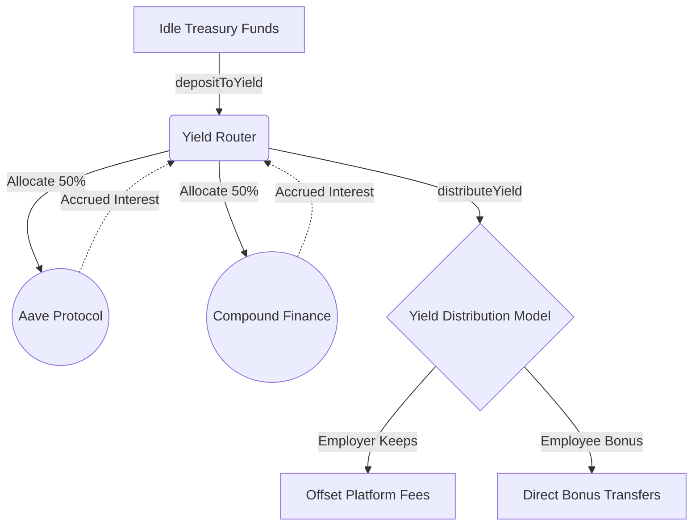

Leaving idle funds in a static checking account is a waste of corporate capital. Employers using Remlo generally deposit their payroll funds into the `PayrollTreasury` days or weeks before payday execution. The `YieldRouter` automatically deploys those idle stablecoin bounds into verified DeFi strategies to actively generate low-risk yield.

## Yield Distribution Models

Employers can actively define how the internally generated interest is resolved and distributed:

- **Employer Keeps**: The default business model. The total generated yield remains in the treasury to directly offset the employer's standard platform subscription fees.
- **Employee Bonus**: Yield is directly forwarded to the employee registry. Instead of offsetting corporate costs, it functions as an effortless automated performance or savings bonus scheme.
- **Split Configuration**: A configurable fractional percentage split between the employer's operating treasury and the aggregate employee wallets.

## Agent Orchestration

The `YieldRouter` exposes `depositToYield`, `distributeYield`, and `rebalance` state mutation functions.

When interfacing directly through the MPP API via `/api/mpp/treasury/optimize`, autonomous AI agents configured via AgentCash can continuously monitor interest rates across the entire L1 network. When an opportunity arises, they can rebalance the employer's treasury allocations seamlessly to maximize their returns without ever requiring a human operator to log into a dashboard.
