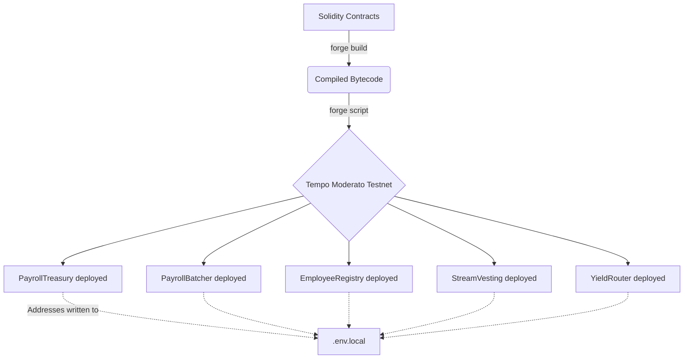

Remlo's execution layer is governed by a suite of five intelligent smart contracts authored in Solidity. These contracts manage treasury bounds, batching logic, streaming payroll, yield optimization, and the employee compliance registry. Before any frontend or API logic can function, these contracts must be compiled and deployed to the Tempo network.

We utilize Foundry as the primary blockchain development framework due to its blazingly fast execution, native Rust compilation, and seamless contract verification workflows.



### Foundry Setup and Configuration

Make sure your local environment is configured to point to the Tempo ecosystem. Ensure that you have the `tempo` variant of Foundry installed:

```bash
# Install the Tempo-compatible Foundry branch
foundryup -n tempo

# Initialize the workspace if deploying fresh
forge init -n tempo remlo-contracts
```

### Preparing for Deployment

You will need a funded tester wallet on the Moderato network to pay for the contract deployment gas fees. 

1. Export your deployment wallet's private key.
2. Use the native `cast` utility to request funds from the Moderato sponsor faucet.

```bash
cast rpc tempo_fundAddress <DEPLOYER_ADDRESS> --rpc-url https://rpc.moderato.tempo.xyz
```

### Executing the Deployment Script

The `Deploy.s.sol` script handles the orchestration, ensuring the contracts are deployed in the correct order so that constructor dependencies (such as the `PayrollBatcher` referencing the `PayrollTreasury`) are respected permanently.

```bash
# Ensure the verifier URL is set for explorer verification
export VERIFIER_URL=https://contracts.tempo.xyz

# Run the deployment broadcast
forge create src/PayrollTreasury.sol:PayrollTreasury \
  --rpc-url https://rpc.moderato.tempo.xyz \
  --interactive \
  --broadcast \
  --verify
```

*Repeat the execution process for each primary contract or utilize the comprehensive `Deploy.s.sol` script for a single-click deployment.*

### Post-Deployment Steps

After successful deployment, Foundry will output the live contract addresses in your terminal. You must manually copy these addresses and inject them into your `.env.local` configuration for the Next.js API layer to interact with the current state.

```properties
NEXT_PUBLIC_PAYROLL_TREASURY=0x...
NEXT_PUBLIC_PAYROLL_BATCHER=0x...
NEXT_PUBLIC_EMPLOYEE_REGISTRY=0x...
NEXT_PUBLIC_STREAM_VESTING=0x...
NEXT_PUBLIC_YIELD_ROUTER=0x...
```
