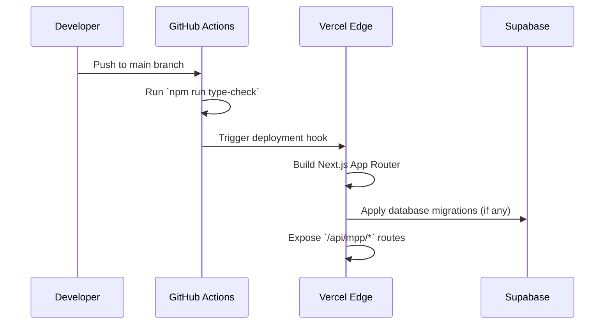

Deploying the Remlo application requires configuring the Next.js runtime, connecting to the managed Supabase instance, and securing the API routes that power the MPP execution layer. Remlo is optimized for deployment on Vercel, which natively supports the Next.js App Router and Edge Functions used heavily throughout the codebase.



### Deployment Prerequisites

Before deploying the Remlo application to production, you must ensure that several external services are properly provisioned and configured:
1. **Supabase Database**: Provision a managed PostgreSQL instance on Supabase. Apply the full SQL schema found in the `REMLO_MASTER.md` to ensure all necessary tables (`employers`, `employees`, `payroll_runs`, etc.) exist with their corresponding Row Level Security (RLS) policies.
2. **Bridge API Ecosystem**: A live Bridge production API key is required to handle fiat on/off-ramping. Configure the webhook secrets to listen for state changes from Bridge regarding KYB and transfer settlements.
3. **Privy Application ID**: You must create a production application in the Privy console. This secures the embedded wallet infrastructure for the Employee Portal and manages corporate logins for the Employer Dashboard.

### Vercel Configuration

The provided `vercel.json` and `next.config.ts` are pre-optimized for serverless environments. 

To deploy using the Vercel CLI:
```bash
npx vercel link
npx vercel pull --environment=production
npx vercel build --prod
npx vercel deploy --prebuilt --prod
```

### Post-Deployment Verification

Once the application is live, you must verify the operational integrity of the MPP execution layer:
- Call the production `GET /api/mpp/treasury/yield-rates` endpoint via `npx agentcash` to ensure the server correctly authenticates the L402 wrapper and queries the Tempo Moderato testnet without timing out.
- Navigate to the Employer Dashboard and confirm that the Privy authentication modal successfully mounts and provisions a test session.
