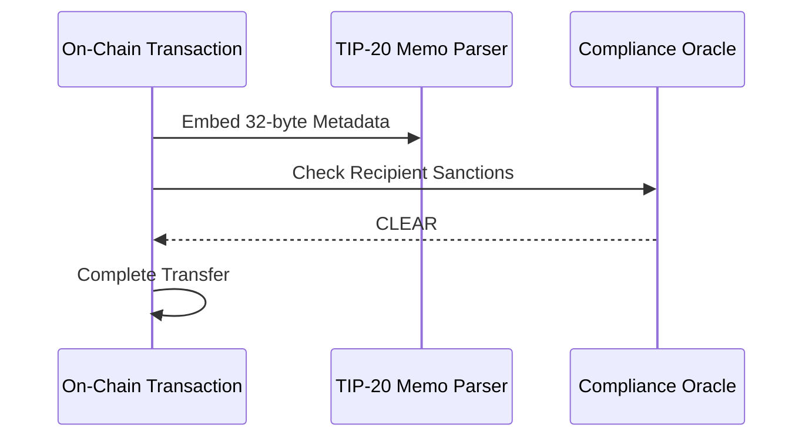

Remlo uses the TIP-20 memo standard native to the Tempo network to encode exhaustive payment details directly into on-chain transactions.

This architecture ensures total data integrity across the entire payroll lifecycle. Furthermore, the TIP-403 standard automatically screens transactions on a foundational protocol level to maintain incredibly strict global compliance standards.

## TIP-20 Memo Encoding Format

Every transfer triggered by a Remlo workflow includes a strict 32-byte memo that adheres structurally to the ISO 20022 banking format. Embedding this data makes on-chain transactions effortlessly machine-readable by accounting software and immediately auditable by corporate compliance teams without risking drift.

### The 32-Byte Structure

| Memory Block | Purpose | Description and Example Input |
|---|---|---|
| **0-3** | Message Type | Standard initialization identifier `0x70616963` (pain.001) |
| **4-11** | Employer ID | Truncated 8-byte hash representing the corporate entity |
| **12-19** | Employee ID | Truncated 8-byte hash representing the recipient profile |
| **20-23** | Pay Period | The execution date formatted as `YYYYMMDD` packed (e.g., `0x07F60301`) |
| **24-27** | Cost Center | The company's internal fiscal budget allocation code |
| **28-31** | Record Hash | Truncated SHA-256 securing the full underlying structural payroll record |

*Need to decipher a payload automatically? Developers can utilize the `/api/mpp/memo/decode` endpoint to parse raw memo strings into standard JSON objects programmatically.*

## TIP-403 Compliance Policies

Global enterprise payroll must respect strict jurisdictional boundaries. Consequently, every Remlo transfer is automatically screened by the `TIP403Registry` precompile on execution.

Instead of running these sanctions screens lazily off-chain, the precompile embeds the logic. This mechanism absolutely guarantees that corporate funds can never touch a globally sanctioned or illicit wallet address without reverting.

- **BLACKLIST Default Policy**: This forms the foundational compliance net, blocking any routing address currently flagged by the network's global compliance oracle. If a wallet hits a recognized AM/KYC snag, the attempted execution directly reverts throwing an on-chain error.
- **Enforced Employee Onboarding**: The registry oracle check is also executed immediately at the time of employee registration. An employee's connected wallet must secure a clear bill of health to be assigned back to the Employer's active payroll roster inside the underlying database schema.
